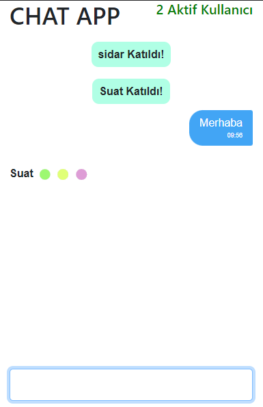
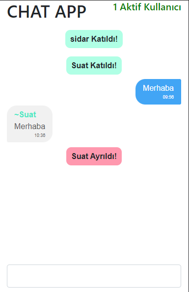

## socketio-chat-room
 A simple chat room by using Node.js and Socket.IO


## Screenshots


1             |  2
:-------------------------:|:-------------------------:
|  |  |

## Run Locally

Clone the project

```bash
  git clone https://github.com/sidarilaslan/socketio-chat-room
```

Go to the project directory

```bash
  cd socketio-chat-room
```

Install dependencies

```bash
  npm install
```

Start the server

```bash
  npm run start
```
Open http://localhost:5000 in your browser.